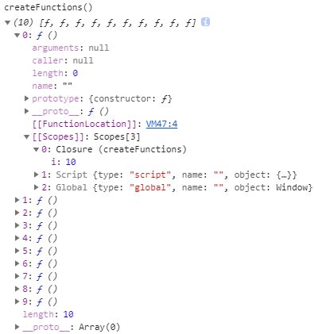

<font face="微软雅黑" size="3">概括： 通过阅读小红书第七章，进行笔记整理，包括： 递归，闭包，模仿块级作用域，私有变量</font> 
<!-- more -->

***
## 定义函数的方式
1. 函数声明
	```js
	function functionName(arg0, arg1, arg2) {
	 //函数体
	} 
	```
	特性： 函数声明提升
2. 函数表达式
	```js
	var functionName = function(arg0, arg1, arg2){
	 //函数体
	}; 
	```
	匿名函数: 因为 function 关键字后面没有标识符。

***
## 递归
递归函数： 函数通过函数名调用自身

```js
//这是一个递归阶乘函数
function factorial(num){
    if (num <= 1){
        return 1;
    } else {
        return num * factorial(num-1);
    }
} 
```
当下面代码执行时，函数报错， 
```js
var anotherFactorial = factorial;  //先把 factorial()函数保存在变量 anotherFactorial 中
factorial = null; //然后将 factorial 变量设置为 null
alert(anotherFactorial(4)); //出错！
```
在接下来调用 anotherFactorial()时，由于必须执行 factorial()，而 factorial 已经不再是函数，所以就会导致错误

**如何解决？**

* 非严格模式
arguments.callee： 是一个指向正在执行的函数；在严格模式下，不能通过脚本访问 arguments.callee。
```js
function factorial(num){
    if (num <= 1) {
        return 1;
    } else {
        return num * arguments.callee(num - 1);
    }
}
```
* 严格模式 or 非严格模式
可通过命名函数表达式，例如将函数命名为fun
```js
var factorial = (function fun(num) {
    if (num <= 1) {
        return 1;
    } else {
        return num * fun(num -1);
    }
})
```

***
## 闭包与变量
定义： 指有权访问另一个函数作用域中的变量的函数。
常见方式： 在一个函数内部创建另一个函数。

**1. 作用域链**
当某个函数被调用时，会创建一个执行环境（execution context）及相应的作用域链。然后，使用 arguments 和其他命名参数的值来初始化函数的活动对象（activation object）。但在作用域链中，外部函数的活动对象始终处于第二位，外部函数的外部函数的活动对象处于第三位，……直至作为作用域链终点的全局执行环境。
```js
function createComparisonFunction(propertyName) {

    //返回一个内部函数(匿名函数)
    return function(object1, object2){
        var value1 = object1[propertyName]; // 访问了外部函数中的变量propertyName
        var value2 = object2[propertyName]; // 访问了外部函数中的变量propertyName

        if (value1 < value2){
          return -1;
        } else if (value1 > value2){
          return 1;
        } else {
         return 0;
        }
    };
} 
```
即使这个内部函数被返回，且在其他地方被调用了，但它仍然可以访问变量 propertyName。因为内部函数的作用域链包含 createComparisonFunction() 的作用域。

```js
//创建函数
var compareNames = createComparisonFunction("name");
//调用函数
var result = compareNames({ name: "Nicholas" }, { name: "Greg" });
//解除对匿名函数的引用（以便释放内存）
compareNames = null; 

//随着匿名函数的作用域链被销毁，其他作用域（除了全局作用域）也都可以安全地销毁了
```

**2. 闭包与变量**
副作用： 闭包只能取得包含函数中任何变量的最后一个值，闭包所保存的是整个变量对象，而不是某个特殊的变量
```js
function createFunctions(){
    var result = new Array();
    for (var i=0; i < 10; i++){
        result[i] = function(){
            return i;
        };
    }
    return result;
} 
//数组包含10个函数，每个函数的返回值 i 都为 10
```


解决: 通过创建一个匿名函数，用参数 num 接受 i , 然后匿名函数内部的函数可通过作用域链访问 num
```js
function createFunctions(){
    var result = new Array();
    for (var i=0; i < 10; i++){
        result[i] = function(num){
            return function () {
                return num
            };
        }(i);
    }
    return result;
} 
```


**3. 关于this**
每个函数在被调用时都会自动取得两个特殊变量：this 和 arguments。内部函数在搜索这两个变量时，只会搜索到其`活动对象`为止，因此永远不可能直接访问外部函数中的这两个变量
```js
var name = "The Window";
var object = {
    name : "My Object",
    getNameFunc : function(){
        return function(){
            return this.name;
        };
    }
};
alert(object.getNameFunc()()); //"The Window"（在非严格模式下）
```

可通过将外部作用域的 this 赋值给一个变量 that ，内部函数可通过访问变量 that 获取到外部作用域
```js
var name = "The Window";
var object = {
    name : "My Object",
    getNameFunc : function(){
        var that = this; 
        return function(){
            return that.name;
        };
    }
};
alert(object.getNameFunc()()); //"My Object"
```

**4. 内存泄露**
`必须要记住`：闭包会引用包含函数的整个活动对象，而其中包含着 element。即使闭包不直接引用 element，包含函数的活动对象中也仍然会保存一个引用。因此，有必要把 element 变量设置为 null。这样就能够解除对 DOM 对象的引用，顺利地减少其引用数，确保正常回收其占用的内存。
```js
function assignHandler(){
    var element = document.getElementById("someElement");
    element.onclick = function(){
        alert(element.id);
    };
} 

//推荐写法
function assignHandler(){
    var element = document.getElementById("someElement");
    var id = element.id;
    
    element.onclick = function(){
        alert(id);
    };
    
    element = null;
}
```
***
## 模仿块级作用域
通过 (function () {})() 创建块级作用域，常在全局作用域中被用在函数外部，从而限制向全局作用域中添加过多的变量和函数。一般来说，我们都应该尽量少向全局作用域中添加变量和函数。
```js
function outputNumbers(count){
    (function () {
        for (var i=0; i < count; i++){
        alert(i);
        }
    })();
    
    alert(i); //导致一个错误！
} 
```
这种做法可以减少闭包占用的内存问题，因为没有指向匿名函数的引用。只要函数执行完毕，就可以立即销毁其作用域链了。