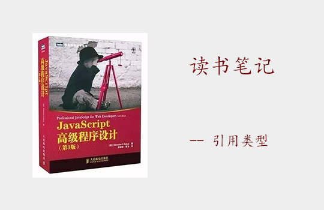
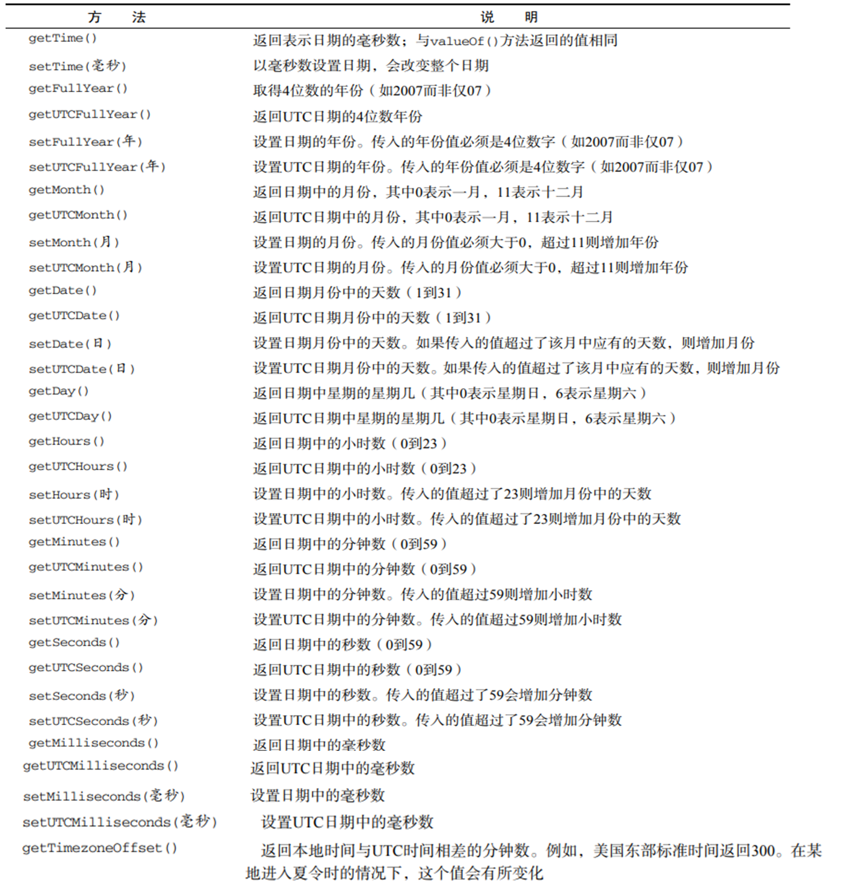
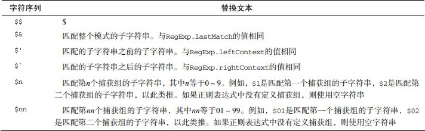
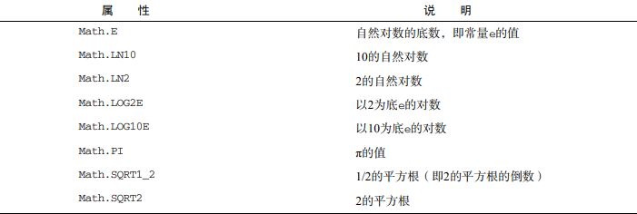
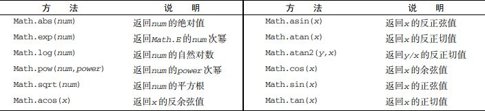

<font face="微软雅黑" size="3">使用对象、创建并操作数组、理解基本的 JavaScript 类型、使用基本类型和基本包装类型</font> 
<!-- more -->


## Object类型

1.创建Object实例的方式：

* new Object()
```js
var person = new Object();
person.name = 'haha';
person.age = 18
```
* 对象字面量: 不会调用 Object 构造函数
```js
var person = {
    name: 'haha',
    age: 18
}
```

2.访问对象属性的方法：
```js
person.name; //haha
person[name]; //haha 
```
括号主要优点：可通过变量访问属性，如果属性名中包含会导致语法错误的字符，或者使用的是关键字或保留字
```js
var propertyName = 'name';
person[propertyName]; //haha
```

## Array类型
1.创建数组的方式

* new Array()
```js
var arr1 = new Array();
var arr2 = new Array(3); // 创建一个长度为3的数组
var arr3 = Array("Greg"); // 创建一个包含 1 项，即字符串"Greg"的数组
```
* 数组字面量: 不会调用 Array 构造函数
```js
var arr = [];
var arr = ["red", "blue", "green"];
```
***
2.length 属性
```js
var colors = ["red", "blue", "green"]; // 创建一个包含 3 个字符串的数组
colors[colors.length] = "black"; //（在位置 3）添加一种颜色
colors[colors.length] = "brown"; //（在位置 4）再添加一种颜色

colors[99] = "black"; // （在位置 99）添加一种颜色
alert(colors.length); // 100 
```
***
3.检测数组： 
```js
value instanceof Array

//ES5
Array.isArray(value)
```
***
4.转换方法

`toString()`: 会返回由数组中每个值的字符串形式拼接而成的一个以逗号分隔的字符串
`valueOf()`: 返回数组
```js
var colors = ["red", "blue", "green"]; // 创建一个包含 3 个字符串的数组
console.log(colors.toString()); // red,blue,green 
console.log(colors.valueOf()); // ["red", "blue", "green"]
console.log(colors); // ["red", "blue", "green"]
```
***
5.栈方法，队列方法

栈是一种 LIFO（Last-In-First-Out，后进先出）的数据结构

* pop(): 从数组末尾移除最后一项，返回<span style="color: #fa8c16">移除的项</span>
* push(): 把接收到的参数逐个添加到数组末尾，返回<span style="color: #fa8c16">修改后数组的长度</span>
* shift(): 移除数组中的第一个项并返回<span style="color: #fa8c16">该项</span>，同时将数组长度减 1
* unshift(): 它能在数组前端添加任意个项并返回<span style="color: #fa8c16">新数组的长度</span>

***
6.重排序方法

* reverse(): 翻转数组的顺序，返回排序后的数组
```js
var values = [1, 2, 8, 4, 5];
values.reverse();
alert(values); //5,4,8,2,1 
```
* sort(): 默认升序，返回排序后的数组
```js
//sort()方法会调用每个数组项的 toString()转型方法，然后比较得到的字符串，以确定如何排序
var values = [0, 1, 5, 10, 15];
values.sort();
alert(values); //0,1,10,15,5 
```
```js
// 可通过给sort()传递一个方法，进行排序
function compare(value1, value2) {
    if (value1 < value2) {
        return -1;
    } else if (value1 > value2) {
        return 1;
    } else {
        return 0;
    }
} 
var values = [0, 1, 5, 10, 15];
values.sort(compare);
alert(values); //0,1,5,10,15
```
***
7.操作方法

* concat(): 返回操作后的新数组，不修改原数组
```js
var colors = ["red", "green", "blue"];
var colors2 = colors.concat("yellow", ["black", "brown"]); //
console.log(colors); //["red", "green", "blue"]
console.log(colors2); //["red", "green", "blue", "yellow", "black", "brown"]
```
* slice(x, y): 返回从该参数指定位置开始到当前数组末尾的所有项，不影响原数组
```js
var colors = ["red", "green", "blue", "yellow", "purple"];
var colors2 = colors.slice(1);
var colors3 = colors.slice(1,4);
console.log(colors2); // ["green", "blue", "yellow", "purple"]
console.log(colors3); // ["green", "blue", "yellow"]
```
* splice()
    * 删除：指定 2 个参数：要删除的第一项的位置和要删除的项数。`splice(0,1)`：删除数组中的前一项
    * 插入：提供 3 个参数：起始位置、0（要删除的项数）和要插入的项
```js
var colors = ["red", "green", "blue"];

var removed = colors.splice(0,1);   // 删除第一项, ["red"]返回的数组中只包含一项
console.log(colors);    // ["green", "blue"]

removed = colors.splice(1, 0, "yellow", "orange"); // 从位置 1 开始插入两项
console.log(colors);    // ["green", "yellow", "orange", "blue"]
console.log(removed);   // 返回的是一个空数组 []

removed = colors.splice(1, 1, "red", "purple"); // 插入两项，删除一项
console.log(colors);    // ["green", "red", "purple", "orange", "blue"]
console.log(removed);   // ["yellow"]，返回的数组中只包含删除的一项
```
***
8.位置方法

* indexOf()：返回某个指定的字符串值在字符串中首次出现的位置。从数组的开头（位置 0）开始向后查找
* lastIndexOf()：返回一个指定的字符串值最后出现的位置，在一个字符串中的指定位置从后向前搜索。
```js
stringObject.indexOf(searchvalue,fromindex)
stringObject.lastIndexOf(searchvalue,fromindex)
```
***
9.迭代方法

* every()：对数组中的每一项运行给定函数，如果该函数对每一项都返回 true，则返回 true。
* some()：对数组中的每一项运行给定函数，如果该函数对任一项返回 true，则返回 true。
* filter()：对数组中的每一项运行给定函数，返回该函数会返回 true 的项组成的数组。
* map()：对数组中的每一项运行给定函数，返回每次函数调用的结果组成的数组。
* forEach()：对数组中的每一项运行给定函数。这个方法没有返回值。
```js
var numbers = [1,2,3,4,5,4,3,2,1];

//filter()
var filterResult = numbers.filter(function(item, index, array){
    return (item > 2);
});
alert(filterResult); //[3,4,5,4,3] 

//every(): 全部 true, 才是 true
var everyResult = numbers.every(function(item, index, array){
 return (item > 2);
});
alert(everyResult); //false

//some(): 有一项是true, 就是true
var someResult = numbers.some(function(item, index, array){
 return (item > 2);
});
alert(someResult); //true 

//map()
var mapResult = numbers.map(function(item, index, array){
 return item * 2;
});
alert(mapResult); //[2,4,6,8,10,8,6,4,2] 

numbers.forEach(function(item, index, array){
 //执行某些操作
}); 
```

***
10.归并方法

* reduce()：法从数组的第一项开始，逐个遍历到最后
* reduceRight()：从数组的最后一项开始，向前遍历到第一项
```js
var values = [1,2,3,4,5];
var sum = values.reduce(function(prev, cur, index, array){
    return prev + cur;
});
alert(sum); //15 
```

## Date类型

1.日期创建方法
```js
var now = new Date();  //不传参：自动获取当前日期和时间
```
创建特定的日期和时间，需传入毫秒数(即从 UTC 时间 1970 年 1 月 1 日午夜起至该日期止经过的毫秒数)
为简化，提供两个方法：

* Date.parse(): 接收一个表示日期的字符串参数
```js
var someDate = new Date(Date.parse("May 25, 2004")); 
var someDate = new Date(Date.parse("6/13/2004")); 

var someDate = new Date("May 25, 2004");  //等价与上面代码，Date构造函数会在后台调用Date.parse()
```
* Date.UTC(): 参数(年份，从0开始的月份【，天(1~31)，小时数(0~23)，分钟、秒，毫秒数】)
```js
// GMT 时间 2000 年 1 月 1 日午夜零时
var y2k = new Date(Date.UTC(2000, 0));

// GMT 时间 2005 年 5 月 5 日下午 5:55:55
var allFives = new Date(Date.UTC(2005, 4, 5, 17, 55, 55)); 

// 等价与上面代码
// 本地时间 2000 年 1 月 1 日午夜零时
var y2k = new Date(2000, 0);
// 本地时间 2005 年 5 月 5 日下午 5:55:55
var allFives = new Date(2005, 4, 5, 17, 55, 55); 
```

* Date.now(): 返回表示调用这个方法时的日期和时间的毫秒数

2.常用方法


## RegExp 类型

1.正则创建方法
```js
// 字面量模式： /\[bc\]at/
var expression = / pattern / flags ; 

// 使用构造函数创建： 所有元字符都必须双重转义 "\\[bc\\]at" 
var expression = new RegExp("pattern", "flags");  
```
* pattern 部分可以是任何正则表达式，可以包含字符类、限定符、分组、向前查找以及反向引用
* flags 部分，用以标明正则表达式的行为: 
    * g：全局(global)模式，表示应用于所有字符串
    * i：忽略大小写
    * m：表示多行（multiline）模式，能换行继续查找
```js
// 匹配字符串中所有"at"的实例
var pattern1 = /at/g;

//匹配第一个"bat"或"cat"，不区分大小写
var pattern2 = /[bc]at/i;

// 匹配所有以"at"结尾的 3 个字符的组合，不区分大小写
var pattern3 = /.at/gi
```

正则表达式中的元字符包括：( [ { \ ^ $ | ) ? * + .]}，如需使用需使用`\`转义
```js
// 匹配第一个"bat"或"cat"，不区分大小写
var pattern1 = /[bc]at/i;

// 匹配第一个" [bc]at"，不区分大小写
var pattern2 = /\[bc\]at/i

// 匹配所有以"at"结尾的 3 个字符的组合，不区分大小写
var pattern3 = /.at/gi

// 匹配所有".at"，不区分大小写
var pattern4 = /\.at/gi
```

**ECMAScript 5 明确规定，使用正则表达式字面量必须像直接调用 RegExp 构造函数一样，每次都创建新的 RegExp 实例**
***
2.RegExp实例属性 -- **没多大用处，因为信息全部包含在模式声明中**

* global：布尔值，表示是否设置了 g 标志。
* ignoreCase：布尔值，表示是否设置了 i 标志。
* lastIndex：整数，表示开始搜索下一个匹配项的字符位置，从 0 算起。
* multiline：布尔值，表示是否设置了 m 标志。
* source：正则表达式的字符串表示，按照字面量形式而非传入构造函数中的字符串模式返回。
```js
var pattern1 = /\[bc\]at/i;

alert(pattern1.global); //false
alert(pattern1.ignoreCase); //true
alert(pattern1.multiline); //false
alert(pattern1.lastIndex); //0
alert(pattern1.source); //"\[bc\]at" 
```


***
3.常见元字符

放截图的地方

## Function类型
函数实际上是对象，每个函数都是 Function 类型的实例， 而且都与其他引用类型一样具有属性和方法，
由于函数是对象，因此函数名实际上也是一个指向函数对象的指针，不会与某个函数绑定。

1.没有重载： 两个同名函数，后面的函数覆盖了前面的函数
***
2.函数属性：length 和 prototype
```js
// length 属性表示函数希望接收的命名参数的个数
function sum(num1, num2){
 return num1 + num2;
}
alert(sum.length); //2
```
prototype 是保存它们所有实例方法的真正所在，不可枚举，无法使用 for-in

***
3.函数的方法：apply() 和 call()
每个函数都包含两个非继承而来的方法，在特定的作用域中调用函数，实际上等于设置函数体内 this 对象的值。

* call()：一个是在其中运行函数的作用域，另一个是直接传值的参数
```js
function sum(num1, num2){
 return num1 + num2;
}

function callSum(num1, num2){
 return sum.call(this, num1, num2);
}

alert(callSum(10,10)); //20 
```

* apply()：一个是在其中运行函数的作用域，另一个是参数数组(Array的实例 / arguments 对象)。
```js
function sum(num1, num2){
 return num1 + num2;
}

function callSum1(num1, num2){
 return sum.apply(this, arguments); // 传入 arguments 对象
}

function callSum2(num1, num2){
 return sum.apply(this, [num1, num2]); // 传入数组
}

// 传入了 this 作为 this 值， 因为是在全局作用域中调用的，所以传入的就是 window 对象
alert(callSum1(10,10)); //20
alert(callSum2(10,10)); //20 
```
* 强大之处： 扩充函数赖以运行的作用域
```js
window.color = "red";
var o = { color: "blue" };

function sayColor(){
    alert(this.color);
}

sayColor(); //red
sayColor.call(this); //red
sayColor.call(window); //red
sayColor.call(o); //blue 
```
* bind()：创建一个函数的实例，其 this 值会被绑定到传给 bind()函数的值
```js
window.color = "red";
var o = { color: "blue" };

function sayColor(){
    alert(this.color);
}

var objectSayColor = sayColor.bind(o);
objectSayColor(); //blue 
```

## 基本包装类型

在读取模式中访问字符串(同理Number, Boolean)时，后台都会自动完成下列处理：
(1) 创建 String 类型的一个实例；
(2) 在实例上调用指定的方法；
(3) 销毁这个实例。
```js
var s1 = new String("some text");
var s2 = s1.substring(2);
s1 = null; 
```
**引用类型与基本包装类型的主要区别就是<span style="color: #fa8c16">对象的生存期</span>**
引用类型: 使用 new 操作符创建的实例，在执行流离开当前作用域之前都一直保存在内存中。
基本包装类型: 自动创建的基本包装类型的对象，则只存在于一行代码的执行瞬间，然后立即被销毁。

这意味着不能在运行时为基本类型值添加属性和方法。
```js
var s1 = "some text"; //1
s1.color = "red"; //2
alert(s1.color); //3 undefined 

//2 创建的 String 对象在执行 3 代码时已经被销毁了。3 代码又创建自己的 String 对象，而该对象没有 color 属性
```

1.Boolean 类型 : 永远不要使用 Boolean 对象。
2.Number 类型 : 不建议直接实例化 Number 类型
```js
var num = 10.005; 
num.toFixed(2);  //"10.01"  指定的小数位返回数值的字符串，四舍五入

var num = 10;
num.toExponential(1); //"1.0e+1"  返回以指数表示法（也称 e 表示法）表示的数值的字符串形式
```
3.String 类型

*  字符方法
```js
var stringValue = "hello world";

// charAt() : 以单字符字符串的形式返回给定位置的那个字符
stringValue.charAt(1); //"e" 

// charCodeAt()：以单字符字符串的形式返回给定位置的那个字符编码
stringValue.charCodeAt(1); //"101" 
```
* 字符串操作方法
```js
// concat(): 将一或多个字符串拼接起来, 返回拼接后的字符串
var stringValue = "hello ";
var result = stringValue.concat("world", "!");  // hello world!

// slice()、substring(): 字符串的开始位置，（在指定的情况下）表示子字符串到哪里结束
// substr(): 字符串的开始位置， 返回的字符个数
// slice()、substr()和 substring()不会修改字符串本身的值
var stringValue = "hello world";

stringValue.slice(3); //"lo world"
stringValue.substring(3); //"lo world"
stringValue.substr(3); //"lo world"

stringValue.slice(3, 7); //"lo w"
stringValue.substring(3,7); //"lo w"
stringValue.substr(3, 7); //"lo worl" 
```
* 字符串位置方法
```js
var stringValue = "hello world";

// indexOf()
alert(stringValue.indexOf("o")); / /第一次出现的位置4

// lastIndexOf()
alert(stringValue.lastIndexOf("o")); // 最后一次出现的位置7 

// 如果没有找到该子字符串，则返回-1
```
* trim()方法
```js
var stringValue = " hello world ";
var trimmedStringValue = stringValue.trim();

alert(stringValue); //" hello world "
alert(trimmedStringValue); //"hello world"
```
* 字符串大小写转换方法
```js
var stringValue = "hello world";

alert(stringValue.toLocaleUpperCase()); //"HELLO WORLD" 是针对特定地区 推荐
alert(stringValue.toUpperCase()); //"HELLO WORLD"

alert(stringValue.toLocaleLowerCase()); //"hello world" 是针对特定地区 推荐
alert(stringValue.toLowerCase()); //"hello world" 
```
* 字符串模式匹配
```js
// replace(RegExp 对象或者一个字符串, 一个字符串或者一个函数)
var text = "cat, bat, sat, fat";
var result = text.replace("at", "ond"); //"cond, bat, sat, fat"

result = text.replace(/at/g, "ond"); //"cond, bond, sond, fond" 
```

```js
var text = "cat, bat, sat, ft";
result = text.replace(/(.at)/g, "word ($1)");
alert(result); //word (cat), word (bat), word (sat), ft
```
* localeCompare()方法
比较两个字符串，并返回下列值中的一个：
    * 如果字符串在字母表中应该排在字符串参数之前，则返回一个负数（大多数情况下是-1）；
    * 如果字符串等于字符串参数，则返回 0；
    * 如果字符串在字母表中应该排在字符串参数之后，则返回一个正数（大多数情况下是 1）。
```js
var stringValue = "yellow";
alert(stringValue.localeCompare("brick")); //1
alert(stringValue.localeCompare("yellow")); //0
alert(stringValue.localeCompare("zoo")); //-1 
```

## 单体内置对象

1.Global 对象
换句话说，不属于任何其他对象的属性和方法，最终都是Global 对象的属性和方法。事实上，没有全
局变量或全局函数；所有在全局作用域中定义的属性和函数，都是 Global 对象的属性。

***
2.Math 对象

*  Math 对象的属性


*  min()和 max()方法
```js
var max = Math.max(3, 54, 32, 16); //54
var min = Math.min(3, 54, 32, 16); //3 
```
* 舍入方法
    * Math.ceil()执行向上舍入，即它总是将数值向上舍入为最接近的整数；
    * Math.floor()执行向下舍入，即它总是将数值向下舍入为最接近的整数；
    * Math.round()执行标准舍入，即它总是将数值四舍五入为最接近的整数
```js
//向上舍入
Math.ceil(25.9); //26
Math.ceil(25.5); //26
Math.ceil(25.1); //26

//四舍五入
Math.round(25.9); //26
Math.round(25.5); //26
Math.round(25.1); //25

//向下舍入
Math.floor(25.9); //25
Math.floor(25.5); //25
Math.floor(25.1); //25 
```
* random()方法： 返回[0, 1)的一个随机数
 值 = Math.floor(Math.random() * 可能值的总数 + 第一个可能的值) 

* 其他方法
