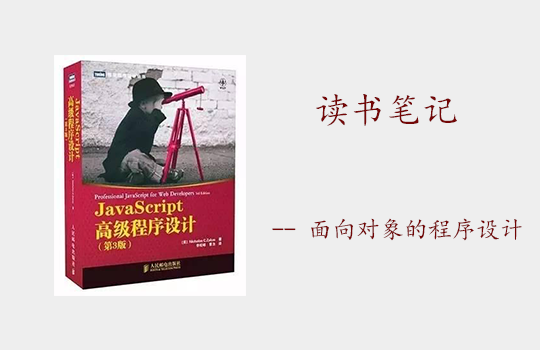
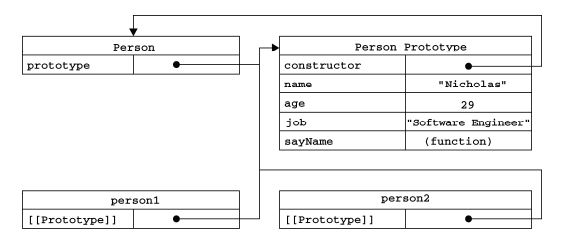
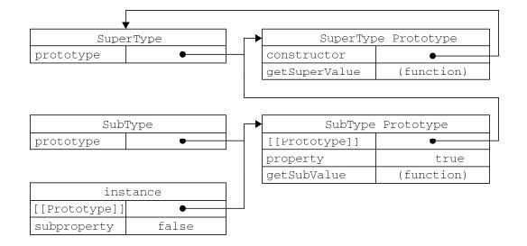
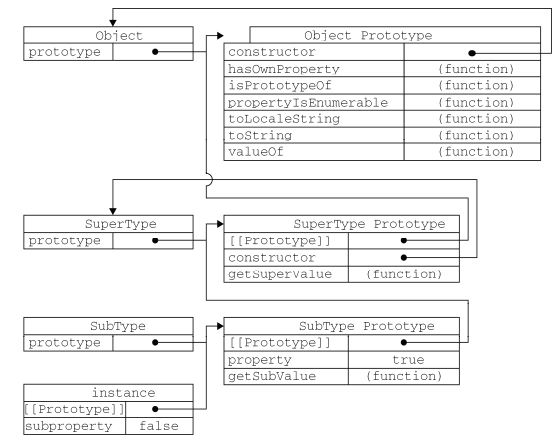

<font face="微软雅黑" size="3">概括： 通过阅读小红书第六章，进行笔记整理，包括： 理解对象，创建对象，继承</font> 
<!-- more -->


----------

## 理解对象
**1.数据属性**

1. 数据属性包含一个数据值的位置，在这个位置可以读取和写入值
2. 特性
> * [[Configurable]]: 能否delete删除，修改属性特性、修改属性类型为访问器。默认true。
> * [[Enumerable]]: 表示能否通过 for-in 循环返回属性。默认true
> * [[Writable]]: 表示能否修改属性的值。 默认true
> * [[value]]: 存取数据值。默认undefined

3. 修改属性默认的特性: Object.defineProperty(所在对象, 属性名, 描述符对象), 描述符对象(configurable、enumerable、writable 和 value。)
```js
var person = {};
Object.defineProperty(person, "name", {
    writable: false,
    value: "Nicholas"
});
person.name = "Greg";
alert(person.name); //"Nicholas" 
```

**2.访问器属性**

1. 不包含数据值，而是包含 getter 和 setter 函数(非必须)，分别用于读取和写入访问器属性时，决定如何处理数据。
2. 特性
> * [[Configurable]]: 能否delete删除，修改属性特性、修改属性类型为访问器。默认true。
> * [[Enumerable]]: 表示能否通过 for-in 循环返回属性。默认true
> * [[Get]]: 在读取属性时调用的函数。默认值为 undefined
> * [[Set]]: 在写入属性时调用的函数。默认值为 undefined

3. 特性的定义和修改
> * 使用 Object.defineProperty()来定义, 参考数据属性
> * 访问器属性常用于修改一个属性的值会导致其他属性发生变化的场合
> * 非严格模式下不一定要同时指定getter和setter，但严格模式下必须指定
> * 不支持defineProperty()方法的浏览器中不能修改[[Configurable]]和[[Enumerable]]

```js
//_year 前面的下划线是一种常用的记号，用于表示只能通过对象方法访问的属性。
var book = {
    _year: 2004,
    edition: 1
};
Object.defineProperty(book, "year", {
    get: function(){
        return this._year;
    },
    set: function(newValue){
        if (newValue > 2004) {
            this._year = newValue;
            this.edition += newValue - 2004;
        }
    }
});
book.year = 2005; //设置一个属性的值会导致其他属性的值发生变化
alert(book.edition); //2 
```

**3.定义多个属性,读取属性**

1. Object.defineProperties(目标对象, 属性对象(描述符)): 通过描述符一次定义多个属性 
2. Object.getOwnPropertyDescriptor(): 读取属性(数据属性, 访问器属性)

```js
var book = {}; 
//定义两个数据属性: _year, edition; 一个访问器属性: year
Object.defineProperties(book, {
    _year: {
        value: 2018
    },
    edition: {
        value: 1
    },
    year: {
        get: function () {
            return this._year;
        },
        set: function (newValue) {
            if (newValue > 2004) {
                this._year = newValue;
                this.edition += newValue - 2004;
            } 
        }
    }
})
var descriptor = Object.definePropertyDesctiptor(book, '_year'); //数据属性
alert(descriptor.value); //2018
alert(descriptor.configurable); //false 
alert(typeof descriptor.get); //"undefined" 
```


## 创建对象

> [JavaScript深入之创建对象的多种方式以及优缺点](https://github.com/mqyqingfeng/Blog/issues/15),  by冴羽，大大的四个系列真心推荐


**1. 工厂模式**
缺点：创建多个相似对象，但无法识别对象，所有实例都指向同一个原型。粗俗点讲就是所有娃都是只认一个爹，不管是不是亲生的。
```js
function parent(name) {
    var o = new Object();
    o.name = name;
    o.sayName = function () {
        console.log(this.name)
    }
    return o;
}
var child = parent('Ange');
```

**2. 构造函数模式**
优点：实例可以识别为一个特定的类型(实例指向相同的原型)
缺点：每次创建实例时，同样的方法都要被创建一次
```js
//构造函数大写字母开头
function Person(name) {
    this.name = name;
    this.sayName = function () {
        console.log(this.name)
    }
}
var per1 = new Person('Ange');
```
`var per1 = new Person()`代码实行以下操作
> * 创建一个新对象
> * 将构造函数的作用域给新对象( this 指向新对象)
> * 执行构造函数中的代码（为这个新对象添加属性）
> * 返回新对象并赋值给变量per1

**2. 优化构造函数模式**
优点: 解决相同方法多次创建的问题
缺点: 全局作用域中定义的函数只能被某个对象调用，这让全局作用域有点名不副实。不算封装...
```js
function Person(name) {
    this.name = name;
    this.sayName = sayName
}
function sayName() {
    console.log(this.name)
}
var per1 = new Person('Ange');
```

**3. 原型模式** 

优点：方法不会重新创建
缺点：1. 所有的属性和方法都共享 2. 不能初始化参数
```js
function Person(){
}
Person.prototype = {
    constructor: Person,
    name : "Nicholas",
    age: 29,

    friends : ["Shelby", "Court"],
    sayName : function () {
        console.log(this.name);
    }
};
var person1 = new Person();
var person2 = new Person();
person1.friends.push("Van");

//person1,person2都指向同一原型，改动一个，另一个也变动
console.log(person1.friends); //"Shelby,Court,Van"
console.log(person2.friends); //"Shelby,Court,Van"
console.log(person1.friends === person2.friends); //true 
```


**4. 组合使用构造函数模式和原型模式**
优点：构造函数模式用于定义实例属性，而原型模式用于定义方法和共享的属性，该共享的共享，该私有的私有
缺点：独立的构造函数和原型时，希望更好的封装
```js
function Person(name){
    this.name = name;
    this.friends = ["Shelby", "Court"];
}
Person.prototype = {
    constructor : Person,
    sayName : function(){
        alert(this.name);
    }
}
var child1 = new Person("Nicholas");
var child2 = new Person("Greg");
child1.friends.push("Van");
alert(child1.friends); //"Shelby,Count,Van"
alert(child2.friends); //"Shelby,Count"
alert(child1.friends === person2.friends); //false
alert(child1.sayName === person2.sayName); //true 
```

**5. 动态原型模式**
使用动态原型模式时，不能使用对象字面量重写原型。前面已经解释过了，如果在已经创建了实例的情况下重写原型，那么就会切断现有实例与新原型之间的联系。
```js
function Person(name){
    //属性
    this.name = name;
    //方法
    if (typeof this.sayName != "function"){
        Person.prototype.sayName = function(){
        alert(this.name);
        };
    }
}
var friend = new Person("Nicholas");
friend.sayName(); 
```
**6. 寄生构造函数模式**
作用: 封装创建对象的代码，然后再返回新创建的对象。 
```js
function Person(name) {
    var o = new Object();
    o.name = name;
    o.getName = function () {
        console.log(this.name);
    };
    
    return o;
}

var child1 = new Person('kevin');
console.log(child1 instanceof Person) // false 创建的实例使用 instanceof 都无法指向构造函数
console.log(child1 instanceof Object) // true
```
这样方法可以在特殊情况下使用。比如我们想创建一个具有额外方法的特殊数组，但是又不想直接修改Array构造函数，我们可以这样写：
```js
function SpecialArray() {
    //创建数组
    var values = new Array();

    //添加值 values.push.apply(values, arguments) 或 下面
    for (var i = 0, len = arguments.length; i < len; i++) {
        values.push(arguments[i]);
    }
    
    //添加方法
    values.toPipedString = function () {
        return this.join("|");
    };
    return values;
}

var colors = new SpecialArray('red', 'blue', 'green');
var colors2 = SpecialArray('red2', 'blue2', 'green2');

console.log(colors);
console.log(colors.toPipedString()); // red|blue|green

console.log(colors2);
console.log(colors2.toPipedString()); // red2|blue2|green2
```
所谓的寄生构造函数模式就是比工厂模式在创建对象的时候，多使用了一个new，实际上两者的结果是一样的。

> 首先，返回的对象与构造函数或者与构造函数的原型属性之间没有关系；也就是说，构造函数返回的对象与在构造函数外部创建的对象没有什么不同。为此，不能依赖 instanceof 操作符来确定对象类型。

**7. 稳妥构造函数模式**
稳妥对象
1. 指的是没有公共属性，而且其方法也不引用 this 的对象
2. 适用环境： 适合在一些安全的环境中（禁止使用 this 和 new），或者在防止数据被其他应用程序（如 Mashup程序）改动时使用。

稳妥构造函数模式
1. 新创建对象的实例方法不引用 this
2. 不使用 new 操作符调用构造函数
```js
function parent(name){
    var o = new Object();
    o.sayName = function(){
        console.log(name);
    };
    return o;
}

var child1 = parent('kevin');
child1.sayName(); // kevin  除了使用 sayName()方法之外，没有其他办法访问 name 的值。
child1.name = "daisy"; 
child1.sayName(); // kevin
console.log(child1.name); // daisy
```
提供一个安全环境，变量 child1 中保存的是一个稳妥对象，变量 name 只能通过 sayName() 方法访问，没有其他方法可已访问其数据成员。

> 使用稳妥构造函数模式创建的对象与构造函数之间也没有什么关系，因此 instanceof 操作符对这种对象也没有意义。

## 继承 

> 这里参考[冴羽][1]，大大的四个系列真心推荐

**1. 原型链**
通过原型链实现继承时，不能使用对象字面量创建原型方法。因为这样做就会重写原型链

```js
function SuperType () {
    this.property = true;
}
SuperType.prototype.getSuperValue = function () {
    return this.property;
}

function SubType () {
    this.subproperty = false; 
}

//继承了 SuperType : 通过创建SuperType的实例，并将该实例赋给SubType.prototype实现的
//实现的本质是 重写原型对象，代之以一个新类型的实例
//换句话说，原来存在于 SuperType 的实例中的所有属性和方法，现在也存在于 SubType.prototype 中了。
SubType.prototype = new SuperType();

SubType.prototype.getSubValue = function (){
 return this.subproperty;
};

var instance = new SubType();
alert(instance.getSuperValue()); //true 
```


众所周知，所有引用类型默认都继承了 Object，而这个继承也是通过原型链实现的。大家要记住，所有函数的默认原型都是 Object 的实例，因此默认原型都会包含一个内部指针，指向 Object.prototype。


问题：
1.引用类型值的原型属性会被所有实例共享, 如下：
```js
function SuperType(){
    this.colors = ["red", "blue", "green"]; //colors属性是一个数组(引用类型值)
}
function SubType(){

}
//继承了 SuperType
SubType.prototype = new SuperType();

var instance1 = new SubType();
instance1.colors.push("black");
alert(instance1.colors); //"red,blue,green,black" 

var instance2 = new SubType();
alert(instance2.colors); //"red,blue,green,black" 

// 表明： SubType 的所有实例都会共享这一个 colors 属性
```
2.在创建子类型的实例时，不能向超类型的构造函数中传递参数


**2. 借用构造函数（伪造对象或经典继承）**
基本思想： 即在子类型构造函数的内部调用超类型构造函数， 通过使用 apply()和 call()方法也可以在（将来）新创建的对象上执行构造函数

1.避免了引用类型的属性被所有实例共享，每个实例都有自己的副本
```js
function SuperType(){
    this.colors = ["red", "blue", "green"];
}
function SubType(){
    //继承了 SuperType
    //通过使用 call()方法（或 apply()方法也可以），在（未来将要）新创建的 SubType 实例的环境下调用了 SuperType 构造函数
    //这样一来，就会在新 SubType 对象上执行 SuperType()函数中定义的所有对象初始化代码， 即 this 指向新创建的实例对象
    SuperType.call(this);
}

var instance1 = new SubType();
instance1.colors.push("black");
alert(instance1.colors); //"red,blue,green,black"

var instance2 = new SubType();
alert(instance2.colors); //"red,blue,green" 

//结果： SubType的每个实例都具有自己的colors属性的副本
```
2.传递参数
```js
function SuperType(name){
    this.name = name;
}
function SubType(){
    //继承了 SuperType，同时还传递了参数
    SuperType.call(this, "Nicholas");

    //为了确保 SuperType 构造函数不会重写子类型的属性，可以在调用超类型构造函数后，再添加应该在子类中定义的属性。
     this.age = 29;
}
var instance = new SubType();
alert(instance.name); //"Nicholas";
alert(instance.age); //29 
```

缺点： 方法都在构造函数中定义，函数无法复用，在超类型的原型中定义的方法，对子类型而言也是不可见的，结果所有类型都只能使用构造函数模式。


**3. 组合继承 -- 最常用**
集经典继承，原型链继承之所长，是 JavaScript 中最常用的继承模式。
```js
function SuperType(name){
    this.name = name;
    this.colors = ["red", "blue", "green"];
}

SuperType.prototype.sayName = function(){
    alert(this.name); 
};

function SubType(name, age){
    //继承属性, this: SubType实例的this
    SuperType.call(this, name);  
    
    //自己的属性
    this.age = age; 
}

//继承方法： 实现方法共享
SubType.prototype = new SuperType(); //将 SuperType 的实例赋值给 SubType 的原型
SubType.prototype.constructor = SubType;    
SubType.prototype.sayAge = function(){
 alert(this.age);
};

var instance1 = new SubType("Nicholas", 29);
instance1.colors.push("black");

alert(instance1.colors); //"red,blue,green,black"
instance1.sayName(); //"Nicholas";
instance1.sayAge(); //29

var instance2 = new SubType("Greg", 27);

alert(instance2.colors); //"red,blue,green"
instance2.sayName(); //"Greg";
instance2.sayAge(); //27 
```

**4. 原型式继承**
```js
function createObj(o){
    function F(){}
    F.prototype = o;
    return new F();
} 
```

createObj函数内，创建一个临时构造函数F， 让函数F的原型指向传入的对象o, 返回一个新实例。 
本质上，createObj对传入的对象进行了一次浅复制（ ES5 Object.create 的模拟实现，将传入的对象作为创建的对象的原型）。

这种原型式继承, 要求你必须有一个对象可以作为另一个对象的基础。如果有这么一个对象的话，可以把它传递给 createObj()函数，然后再根据具体需求对得到的对象加以修改即可
例子： 
```js
//基础对象  
var person = {
    name: 'kevin',
    friends: ['daisy', 'kelly']
}

// createObj(person) 创建的新对象将 person 作为原型，所以它的原型中就包含一个基本类型值属性和一个引用类型值属性
var person1 = createObj(person); 
var person2 = createObj(person);

person1.name = 'person1';
console.log(person2.name); // kevin

person1.firends.push('taylor');
console.log(person2.friends); // ["daisy", "kelly", "taylor"]
``` 
注意：修改person1.name的值，person2.name的值并未发生改变，并不是因为person1和person2有独立的 name 值，而是因为person1.name = 'person1'，给person1添加了 name 值，并非修改了原型上的 name 值。

缺点：包含引用类型的属性值始终都会共享相应的值，这点跟原型链继承一样。


**5. 寄生式继承**
创建一个仅用于封装继承过程的函数，该函数在内部以某种形式来做增强对象，最后返回对象。
```js
function createAnother(original){
    var clone = object(original); //通过调用函数创建一个新对象
    clone.sayHi = function(){ //以某种方式来增强这个对象
        alert("hi");
    };
    return clone; //返回这个对象
} 
```
缺点：跟借用构造函数模式一样，每次创建对象都会创建一遍方法。

**6. 寄生组合式继承**
寄生组合式继承： 借用构造函数来继承属性，通过原型链的混成形式来继承方法


组合模式最大缺点： 会调用两次超类型构造函数(父构造函数)
先回忆一下`组合模式`:
```js
//组合模式
function SuperType(name){
    this.name = name;
    this.colors = ["red", "blue", "green"];
}

SuperType.prototype.sayName = function(){
    alert(this.name);
};

function SubType(name, age){
    //第二次调用 SuperType(): 当调用 SubType 构造函数时，又会调用一次 SuperType 构造函数，这一次又在新对象上创建了实例属性 name 和 colors。这两个属性就屏蔽了原型中的两个同名属性。
    SuperType.call(this, name);    

    //自己的属性  
    this.age = age;
}

// 第一次调用 SuperType(): `SubType.prototype`会得到两个属性： name 和 colors，它们都是SuperType的实例属性，只不过现在位于 SubType 的原型中。
SubType.prototype = new SuperType(); 

var child1 = new SubType('kevin', '18');
```

那如果不使用SubType.prototype=new SuperType()，而是简洁让SubType.prototype访问到SuperType.prototype呢？

基本思路：不必为了指定子类型的原型而调用超类型的构造函数，我们所需要的无非就是超类型原型的一个副本而已。本质上，就是使用寄生式继承来继承超类型的原型，然后再将结果指定给子类型的原型。
```js
function SuperType(name){
    this.name = name;
    this.colors = ["red", "blue", "green"];
}

SuperType.prototype.sayName = function(){
    alert(this.name);
};

function SubType(name, age){
    SuperType.call(this, name);     
    this.age = age;
}

//重点三步！！！
var F = function () {};
F.prototype = SuperType.prototype;
SubType.prototype = new F();

var child1 = new SubType('kevin', '18');
```

最后我们封装一下这个继承方法：
```js
function object(o) {
    function F() {}
    F.prototype = o;
    return new F();
}

//接收参数： 子类型构造函数，超类型构造函数
function inheritPrototype(subType, superType) {
    //创建对象: 创建超类型原型的一个副本
    var prototype = object(superType.prototype); 
    
    //增强对象: 为创建的副本添加 constructor 属性，从而弥补因重写原型而失去的默认的 constructor 属性
    prototype.constructor = subType;      
    
    //制定对象: 新创建的对象（即副本）赋值给子类型的原型
    subType.prototype = prototype;              
}
```

当我们使用的时候：
```js
function SuperType(name){
    this.name = name;
    this.colors = ["red", "blue", "green"];
}
SuperType.prototype.sayName = function(){
    alert(this.name);
};
function SubType(name, age){
    SuperType.call(this, name);

    this.age = age;
}
inheritPrototype(SubType, SuperType);
SubType.prototype.sayAge = function(){
    alert(this.age);
}; 

```