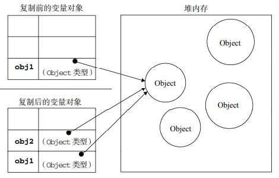
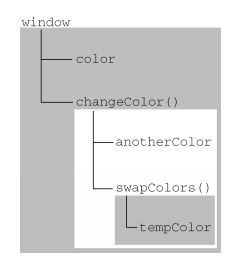

<font face="微软雅黑" size="3">概括： 通过阅读小红书第四张章，进行笔记整理，包括： 变量，作用域和内存问题</font> 
<!-- more -->


## 基本类型和引用类型的值

1. 两种值类型
    * 基本类型： 
      - 简单的数据段，基本数据类型：Undefined、Null、Boolean、Number 和 String
      - 操作保存在变量中的实际的值
    * 引用类型： 
      - 那些可能由多个值构成的对象
      - 在操作对象时，实际上是在操作对象的引用而不是实际的对象。引用类型的值是按引用访问的

2. 复制变量值
    * 基本类型： 两个变量可以参与任何操作而不会互相影响
    ```js
    var num1 = 5;
    var num2 = num1;
    ```

    * 引用类型： 实际上是一个指针，而这个指针指向存储在堆中的一个对象。复制操作结束后，两个变量实际上将引用同一个对象。因此，改变其中一个变量，就会影响另一个变量，
    ```js
    var obj1 = new Object();
    var obj2 = obj1;
    obj1.name = "Nicholas";
    alert(obj2.name); //"Nicholas" 
    ```
    

3. 传递参数
    > 可以把 ECMAScript 函数的参数想象成局部变量。

    * 参数只能按值传递：把函数外部的值复制给函数内部的参数，就和把值从一个变量复制到另一个变量一样
    * 基本类型的值： 被传递的值会被复制给一个局部变量（即命名参数，arguments 对象中的一个元素）
    * 引用类型的值： 把这个值在内存中的`地址`复制给一个局部变量

4. 检测类型
    * 基本类型： typeof
    ```js
    var s = "Nicholas";
    var b = true;
    var i = 22;
    var u;
    var n = null;
    var o = new Object();
    
    alert(typeof s); //string
    alert(typeof i); //number
    alert(typeof b); //boolean
    alert(typeof u); //undefined
    alert(typeof n); //object
    alert(typeof o); //object 
    ```
    * 引用类型： instanceof
    ```js
    alert(person instanceof Object); // 变量 person 是 Object 吗？
    alert(colors instanceof Array); // 变量 colors 是 Array 吗？
    alert(pattern instanceof RegExp); // 变量 pattern 是 RegExp 吗？
    ```

## 执行环境(执行上下文)及作用域

### 执行环境
[讶羽：《JavaScript深入之执行上下文》](https://github.com/mqyqingfeng/Blog/issues/8)。
当 JavaScript 代码执行一段可执行代码(executable code)时，会创建对应的执行上下文(execution context)。
定义： 变量或函数有权访问的其他数据，决定了它们各自的行为。

对于每个执行上下文，都有三个重要属性：

* 变量对象(Variable object，VO) -- [讶羽：《JavaScript深入之变量对象》 ](https://github.com/mqyqingfeng/Blog/issues/5)
* 作用域链(Scope chain) -- [讶羽：《JavaScript深入之作用域链》](https://github.com/mqyqingfeng/Blog/issues/6)
* this  -- [讶羽：《JavaScript深入之从ECMAScript规范解读this》](https://github.com/mqyqingfeng/Blog/issues/7)

```js
var color = "blue";
function changeColor(){
	var anotherColor = "red";
	function swapColors(){
		var tempColor = anotherColor;
		anotherColor = color;
		color = tempColor;

	 	// 这里可以访问 color、anotherColor 和 tempColor
	}

 	// 这里可以访问 color 和 anotherColor，但不能访问 tempColor
 	swapColors();
}
// 这里只能访问 color
changeColor();
```
以上代码共涉及 3 个执行环境：全局环境、changeColor()的局部环境和 swapColors()的局部环境


### 延长作用域链
是当执行流进入下列任何一个语句时，作用域链就会得到加长, 这两个语句都会在作用域链的前端添加一个变量对象

* try-catch 语句的 catch 块: 创建一个新的变量对象，包含被抛出的错误对象的声明。
* with语句: 将指定的对象添加到作用域链中。

```js
function buildUrl() {
	var qs = "?debug=true";

	//with语句接收location对象，将其包含location对象所有属性和方法的变量对象添加到了作用域链的前端。
	with(location){
		//在with语句中引用变量href时实际引用的是location.href
		var url = href + qs;
	}
	return url;
} 
```

### 垃圾收集
1. 自动垃圾收集机制: 离开作用域的值将被自动标记为可以回收，因此将在垃圾收集期间被删除

2. 垃圾收集策略： 
	* 标记清除： 给当前不使用的值加上标记，然后再回收其内存。目前主流的垃圾收集算法
	* 引用计数： 跟踪记录所有值被引用的次数。JavaScript引擎目前都不再使用这种算法

3. 管理内存：优化内存的最佳方式是解除引用
	* 解除引用：为代码只保存执行中必要的数据，将无用数据的值设置为null来释放其引用
	* 最需要解除引用的数据：一般不会自动释放的数据，如全局对象、全局对象属性以及循环引用。
	* 解除引用并不意味着内存回收，只是让值脱离执行环境以便垃圾收集器下次运行时回收。

解除变量的引用不仅有助于消除循环引用现象，而且对垃圾收集也有好处。为了确保有效地回收内存，应该及时解除不再使用的全局对象、全局对象属性以及循环引用变量的引用。